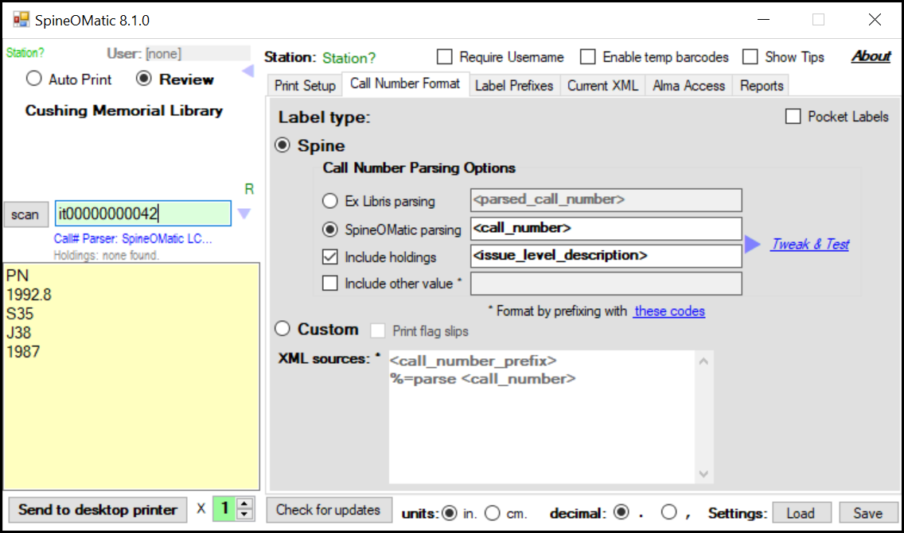

# mod-spine-o-matic

A middleware module for providing Alma like XML responses for use with [SpineOMatic](https://github.com/ExLibrisGroup/SpineOMatic).

Copyright (C) 2018 The Open Library Foundation

This software is distributed under the terms of the Apache License, Version 2.0.
See the file ["LICENSE"](LICENSE) for more information.

## API

There is a single endpoint `/spine-label?identifier={item barcode|item hrid}`.

## Sample use with SpineOMatic

Configure Alma Access to mod-spine-o-matic


Use default call number parsing



Use custom label


### available XML fields

```
<title>
<call_number_prefix>
<call_number>
<call_number_type_name>
<call_number_type>
<enumeration>
<chronology>
<issue_level_description>
<library_name>
<library_code>
<location_name>
<location_code>
<current_date>
<enum_latest>
<chron_latest>
<enum_n> *
<chron_n> *

* where n is the line number from receiving history (i.e. chron_2)
```

### seperate call number prefix
| barcode      | item hrid     |
| ------------ | ------------- |
| A14839145884 |               |

Custom

XML sources:
```
<call_number_prefix>
%<call_number>
```

A14839145884
```
Oversize
PN
6728
A37
M55
2006
```

### enumeration and chronology populated
| barcode      | item hrid     |
| ------------ | ------------- |
| A14811944997 | it00000000005 |
| A14814371046 | it00000000006 |
| A14812022756 | it00000000007 |

Custom

XML sources:
```
%<call_number>
<chronology>
<enumeration>
```

A14811944997
```
SB
450.9
N45
1987
v.1:no.1-6
```

A14814371046
```
SB
450.9
N45
1987
v.1:no.7-12
```

A14812022756
```
SB
450.9
N45
1988
v.2
```

### enumeration null, chronology populated
| barcode      | item hrid     |
| ------------ | ------------- |
| A14809369076 | it00000663619 |
| A14809369084 | it00000663620 |
| A14809369092 | it00000663621 |

Custom

XML sources:
```
%<call_number>
<chronology>
```

A14809369076
```
TK
454.2
I15
1985:v.1
```

A14809369084
```
TK
454.2
I15
1985:v.2
```

A14809369092
```
TK
454.2
I15
1985:v.3
```

### enumeration populated, chronology null
| barcode      | item hrid     |
| ------------ | ------------- |
| A14809356455 | it00000663602 |
| A14809356463 | it00000663603 |
| A14809356471 | it00000663604 |

Custom

XML sources:
```
%<call_number>
<enumeration>
```

A14809356455
```
PQ
6089
C37
1982
v.1:pt.a
```

A14809356463
```
PQ
6089
C37
1982
v.2
```

A14809356471
```
PQ
6089
C37
1982
v.3
```

### barcode is null, so input hrid
| barcode      | item hrid     |
| ------------ | ------------- |
|              | it00000165900 |
|              | it00000000042 |
|              | it00000165904 |

Spine

SpineOMatic parsing `<call_number>`

it00000165900
```
Z
1006
C6
```

it00000000042
```
PN
1992.8
S35
J38
1987
```

it00000165904
```
Z
1006
C37
1966
```

### enumerations and chronologies from holdings by hrid
| barcode      | holdings hrid |
| ------------ | ------------- |
|              | ho00000044908 |


Custom

XML sources:
```
%<call_number>
<chron_1>
<enum_1>
<chron_latest>
<enum_latest>
```

ho00000044908
```
UG
633
A65
(2021 May)
v. 104, no. 5 
(2020 Jan.-Feb.)
v. 104, no. 1-2 
```

## Additional Information

Other [modules](https://dev.folio.org/source-code/#server-side).

Other FOLIO Developer documentation is at [dev.folio.org](https://dev.folio.org/).

## Docker deployment

When deploying docker, be sure to set the appropriate ports for your environment (make the guest port matches the port specified in `src/main/resources/application.yml` file).
In the example below, the `-p 9000:9000` represents `-p [host port]:[guest port]` with *guest* referring to the docker image and *host* referring to the system running docker.

```
docker build -t folio/mod-spine-o-matic .
docker run -d -p 9000:9000 folio/mod-spine-o-matic
```

### Publish docker image

```
docker login [docker repo]
docker build -t [docker repo]/folio/mod-spine-o-matic:[version] .
docker push [docker repo]/folio/mod-spine-o-matic:[version]
```

### Issue tracker

See project [FOLIO](https://issues.folio.org/browse/FOLIO)
at the [FOLIO issue tracker](https://dev.folio.org/guidelines/issue-tracker/).
